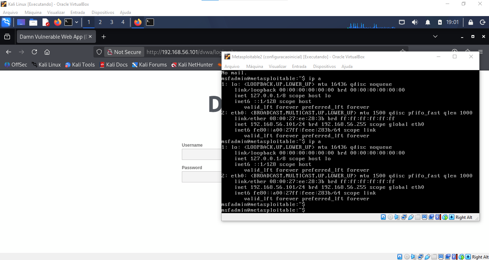

# Projeto Prático: Simulação de Ataque de Força Bruta com Medusa 🛡️

Este projeto foi desenvolvido como parte do **Curso de Cibersegurança da Riachuelo**, oferecido através da plataforma **DIO (Digital Innovation One)**. O objetivo é demonstrar o uso de ferramentas de auditoria no Kali Linux e a importância de políticas de senhas robustas.

## 🛠️ Ambiente do Desafio

Para a execução deste laboratório, foi estruturado um ambiente seguro e isolado utilizando o **Oracle VirtualBox**:

* **Sistema Atacante:** Kali Linux (Rolling Edition).
* **Sistema Alvo:** Metasploitable 2 (Máquina virtual intencionalmente vulnerável).
* **Rede:** Configurada como "Placa de Rede Exclusiva de Hospedeiro" (Host-Only) para garantir que os testes não afetem redes externas.
* **IP do Alvo (Metasploitable):** `192.168.56.101`


> *Evidência: Máquinas virtuais configuradas e prontas para o teste de intrusão.*

---

## 🚀 Execução Técnica: Força Bruta em Serviço FTP

Utilizei a ferramenta **Medusa**, um testador de login paralelo, modular e veloz, para tentar quebrar a autenticação do serviço FTP do alvo.

### 1. Preparação de Listas (Wordlists)
Criei dois arquivos fundamentais para o ataque:
* `users.txt`: Lista contendo nomes de usuários prováveis (ex: admin, root, msfadmin).
* `passwords.txt`: Lista com senhas comuns (ex: 123456, password, admin, msfadmin).

### 2. Comando Executado no Kali Linux
```bash
medusa -h 192.168.56.101 -U users.txt -P passwords.txt -M ftp

```

 #### 2.1. Explicação dos parâmetros:

* `-h`: Endereço IP do alvo.

* `-U`: Caminho para o arquivo de lista de usuários.

* `-P`: Caminho para o arquivo de lista de senhas.

* `-M`: Define o módulo do serviço (neste caso, ftp).

---

### 📊 Resultados do Teste

O teste foi concluído com sucesso ao identificar as credenciais de acesso do serviço alvo, conforme demonstrado abaixo:

* **Host Alvo:** `192.168.56.101`
* **Serviço:** FTP
* **Usuário Identificado:** `msfadmin`
* **Senha Identificada:** `msfadmin`
* **Status Final:** `[SUCCESS]`

  ---

### 🛡️ Medidas de Mitigação (Prevenção)

Para evitar que ataques de força bruta (Brute Force) tenham sucesso em ambientes reais, as seguintes medidas de segurança são recomendadas como boas práticas aprendidas no curso:

1.  **Políticas de Senhas Fortes:** Implementar a obrigatoriedade de senhas complexas (mínimo de 12 caracteres, incluindo letras maiúsculas, minúsculas, números e símbolos).
2.  **Bloqueio de Conta (Account Lockout):** Configurar o sistema para bloquear automaticamente o acesso após 3 ou 5 tentativas de login consecutivas sem sucesso.
3.  **Implementação de Fail2Ban:** Utilizar ferramentas que monitoram os logs do sistema e banem temporariamente o endereço IP que demonstrar comportamento de ataque.
4.  **Uso de Autenticação Multifator (MFA):** Adicionar uma camada extra de verificação, exigindo um código temporário além da senha.
5.  **Desativação de Serviços Inúteis:** Se o serviço (como o FTP) não for essencial para a operação, ele deve ser desativado para reduzir a superfície de ataque.

---

## 🎓 Créditos e Instituição

Este projeto integra o portfólio técnico desenvolvido durante a trilha de aprendizado:

* **Curso:** Cibersegurança - Formação de Talentos
* **Parceiro:** [Riachuelo](https://www.riachuelo.com.br/)
* **Plataforma:** [DIO (Digital Innovation One)](https://www.dio.me/)
* **Desenvolvido por:** [Tarcísio Alves Bertolino]

---
> **Aviso Legal:** Toda a atividade documentada neste repositório foi realizada em um ambiente de laboratório controlado (Sandboxing). O uso destas ferramentas para acessar sistemas sem autorização prévia é ilegal e antiético.
